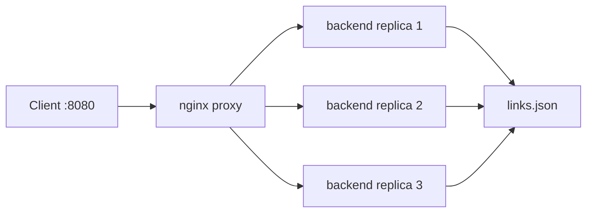

# Slink

**S**hort **link** — a lightweight URL shortener API built with FastAPI. Create short links with optional custom codes, deduplicate by canonical URL, list and resolve links, and redirect via permanent 308 responses. Persists to local JSON for simple self-hosted use.

Links are stored in `data/links.json` (git-ignored).

## Frontend

A web UI is not implemented yet. Use the REST API (see [Endpoints](#endpoints)) or Swagger at `/docs` when the server is running.

## Setup

From the repo root (Git Bash on Windows):

```bash
./scripts/setup.sh
```

Creates `.venv`, installs dependencies from `requirements.txt`, and copies `.env.example` to `.env` if `.env` does not exist yet.

## Run (local)

```bash
./scripts/dev.sh
```

Starts a single API process with reload at http://127.0.0.1:8000 (see `BASE_URL` in `.env`).

- API docs: http://127.0.0.1:8000/docs
- Health: http://127.0.0.1:8000/health

## Docker

The containerized setup runs **3 API replicas** behind an **nginx reverse proxy**. Only the proxy is published to the host — backends stay on the internal Docker network.



| Service | Role | Host port |
|---------|------|-----------|
| `proxy` | nginx load balancer | **8080** → container `:80` |
| `backend` ×3 | FastAPI (uvicorn) | none (internal only) |

All replicas share the same `links.json` (bind mount in dev, named volume in prod).

### Dev

```bash
docker compose up --build
```

- App: http://localhost:8080
- Health: http://localhost:8080/health
- API docs: http://localhost:8080/docs
- Data: `./data` bind-mounted into each replica

Set `BASE_URL=http://localhost:8080` in `.env` so generated `short_url` values match the proxy port.

### Prod

```bash
docker compose -f docker-compose.prod.yml up --build -d
```

Same topology as dev, with extra hardening on the backend (`read_only`, `cap_drop: ALL`, `no-new-privileges`) and proxy (`read_only` rootfs, `tmpfs` for nginx runtime dirs, `restart: unless-stopped`). Data persists in the `db_data` Docker volume.

### How scaling works

- Compose `scale: 3` on the `backend` service starts three identical containers.
- nginx upstream uses Docker embedded DNS (`127.0.0.11`) with `resolve` to round-robin across replicas as they start, stop, or restart.
- Worker processes run as the non-root `nginx` user (`user nginx` in `nginx/nginx.conf`).

### Verify load balancing

`GET /health` returns a `backend_id` (container hostname). Repeat requests through the proxy to see different replicas:

```bash
for i in {1..12}; do curl -s http://localhost:8080/health; echo; done
```

Check running containers:

```bash
docker compose ps
```

## Endpoints

| Method | Path | Description |
|--------|------|-------------|
| GET | `/health` | Health check (`status`, `backend_id` in Docker) |
| POST | `/api/shorten` | Create or reuse short link (**201** new, **200** existing URL) |
| GET | `/api/links/{code}` | Link metadata |
| GET | `/api/links` | List all links |
| GET | `/{code}` | **308** permanent redirect to original URL |

## Examples

Local dev (`./scripts/dev.sh`):

```bash
curl -X POST http://127.0.0.1:8000/api/shorten \
  -H "Content-Type: application/json" \
  -d '{"url": "https://example.com"}'

curl http://127.0.0.1:8000/api/links/abc123
curl -I http://127.0.0.1:8000/abc123
```

Docker (via nginx on port 8080):

```bash
curl -X POST http://localhost:8080/api/shorten \
  -H "Content-Type: application/json" \
  -d '{"url": "https://example.com"}'

curl http://localhost:8080/health
```

### POST `/api/shorten` response

| Field | Description |
|-------|-------------|
| `code` | Short code |
| `short_url` | Full short URL (`BASE_URL` + code) |
| `original_url` | Stored destination URL |
| `message` | `"Link created successfully"` (**201**) or `"Short link already exists for this URL"` (**200**) |

Submitting the same URL again (after canonicalization — scheme/host casing and trailing slashes) returns **200** with the existing code and the reuse message. A new URL returns **201**.

Full decision flow (dedup, custom codes, collisions): [docs/post-shorten-flow.md](docs/post-shorten-flow.md).

## Storage

Saved links live in `data/links.json`. Each entry includes `code`, `url`, `url_hash` (SHA-256 of the canonical URL for deduplication), and `created_at`. The file is created on first save and is not committed (see `.gitignore`).

## Tests

```bash
pytest
```
