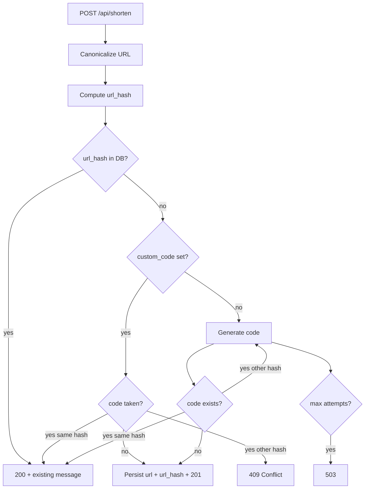

# POST `/api/shorten` decision flow

How `create_link` in [`app/services/shortener.py`](../app/services/shortener.py) chooses a response. URLs are deduplicated via a canonical form and SHA-256 `url_hash` (see [`app/services/url_normalize.py`](../app/services/url_normalize.py)).

## Flow

## HTTP outcomes

| Situation | HTTP | `message` (success body) |
| --------- | ---- | ------------------------ |
| New link | **201** | `"Link created successfully"` |
| URL already shortened (hash match) | **200** | `"Short link already exists for this URL"` |
| Custom code taken by another URL | **409** | `detail`: `"Code '{code}' is already taken"` |
| Storage I/O or corrupt JSON | **503** | Storage error message from [`app/data_store.py`](../app/data_store.py) |
| Auto code: all attempts collide with other URLs | **503** | `"Unable to allocate a unique short code"` |

Same URL with different scheme/host casing or trailing slash resolves to the same `url_hash` and returns **200** with the existing code.
